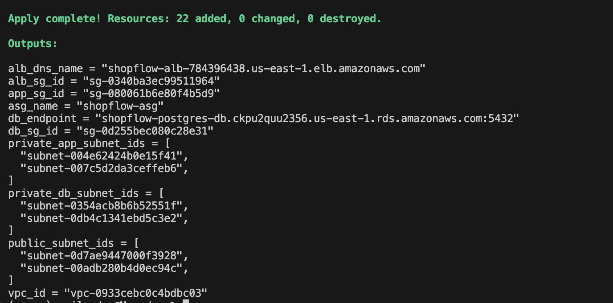

# ShopFlow

ShopFlow is a polyglot microservices e-commerce platform built for portfolio and cloud engineering practice.

## Services

- user-service: Python FastAPI
- product-service: Go
- order-service: Java Spring Boot

## Phase 1 Features

- health endpoints
- register/login/profile APIs
- product listing APIs
- create order and view orders APIs

## Run locally

### User service
```bash
cd services/user-service
python -m venv .venv
source .venv/bin/activate
pip install -r requirements.txt
uvicorn app.main:app --reload --port 8001
```
